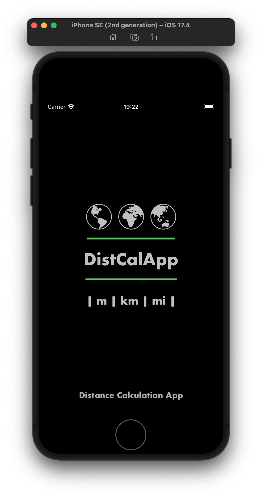
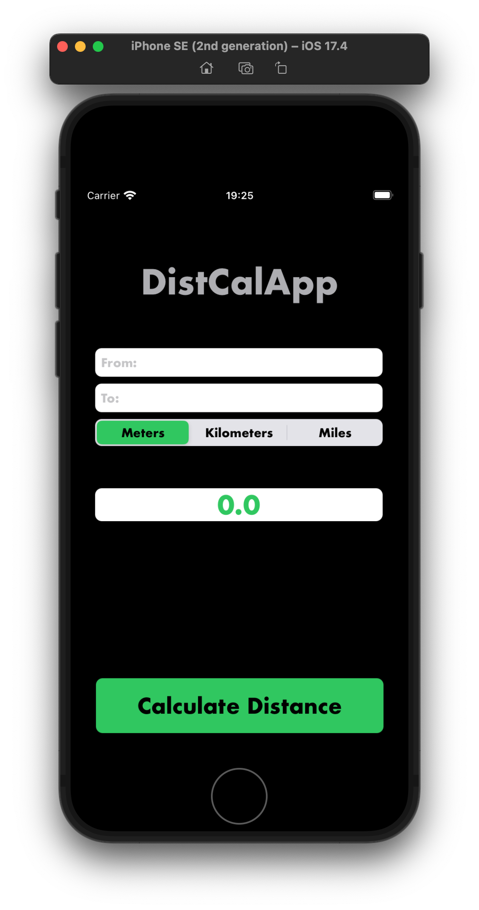
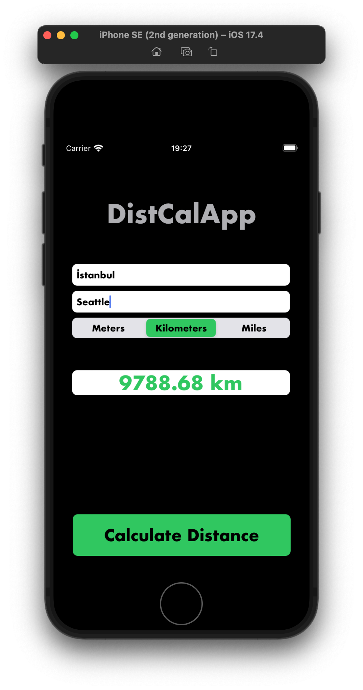

# DistCalApp
DistCalApp is an application used for performing long-distance computation tasks. DistCalApp is an application that allows users to calculate the distance between two different places and present the results in meters, kilometers, and miles. I developed this project to improve my skills in Objective-C programming.

### Objectives
- Strengthen proficiency in Objective-C programming language
- Gain practical experience in developing iOS applications using Objective-C
- Implement design patterns and architectural principles in Objective-C projects
- Improve code readability, maintainability, and efficiency in Objective-C codebases

## Screenshots
<div style="display: flex; justify-content: space-around;">
    
    
    
</div>

## Features
- Calculate distance between two places
- Present distance in meters, kilometers, and miles
- User-friendly interface

## Getting Started
To get started with the project, follow these steps:
1. Clone the repository to your local machine:
```bash
git clone https://github.com/iammertozcan/DistCalApp.git
```
2. Open the project in your preferred IDE (e.g., Xcode).
3. Run the `DistCalApp.xcworkspace` file.
4. Start using the application to calculate distances!

## Usage
1. Enter the name of the two places you want to calculate the distance between(e.g., Paris, Istanbul, Seattle).
2. Select the desired units (meters, kilometers, or miles).
3. Click the "Calculate Distance" button to see the distance between the places in the chosen units.
4. The application will display the calculated distances in the specified units.

## Contributing
Contributions are welcome! If you'd like to contribute to this project, please follow the steps below:
1. Fork this repository (https://github.com/iammertozcan/DistCalApp)
2. Create a new branch for your feature or bug fix:
```
git checkout -b feature/NewFeature
```
3. Commit your changes:
```
git commit -am 'Added a new feature'
```
4. Push your branch to your fork:
```
git push origin feature/NewFeature
```
5. Create a new Pull Request.

## Contact
If you have any questions or feedback, please reach out to us at [iammertozcan@gmail.com](mailto:iammertozcan@gmail.com).
